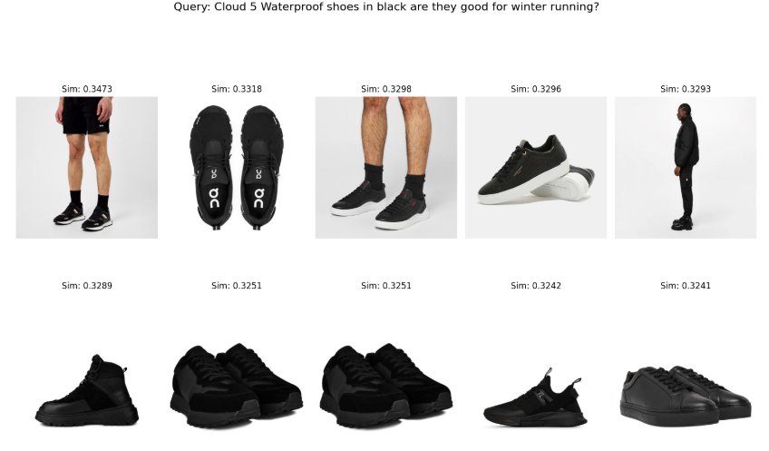
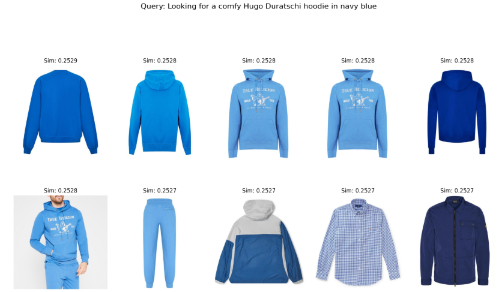

# Clothing Recommendation System Using LLM, ResNet, and CLIP
## Overview
This project aims to provide personalized clothing recommendations based on user queries. The system leverages deep learning models to generate embeddings for both user queries and images of clothing items in a store. By comparing these embeddings, the system retrieves the most relevant clothing items that match the user's preferences.

## Data Collection
For this project, I collected a large dataset of clothing items from e-commerce website (https://www.flannels.com/) using web scraping techniques. I collected a diverse dataset of clothing items from e-commerce websites using Selenium and BeautifulSoup. The data includes:

1. Images: Product images representing the clothing items.
2. Descriptions: Textual descriptions detailing the features of each item.
3. Brand: Information on the brand of each product.
4. Details: Additional attributes like size, material, color, and style.

Additionally, I utilized the Gemini API to generate mimicking queries from the product descriptions, which helps in creating more accurate and diverse search queries for the recommendation system.

## Using CLIP for Cross-Modal Clothing Recommendation
CLIP (Contrastive Language-Image Pretraining) is used in this project to connect user queries with clothing images from store. When a customer submits a query like "blue summer dress," CLIP converts that text into an embedding, a high-dimensional representation that captures the meaning of the query. It does the same for the images of clothing items from the store.

Both the text and image embeddings are then compared to find how similar they are. The higher the similarity between the query and an image, the more relevant that clothing item is to the user’s request. This way, CLIP helps the system recommend clothing items that match both visually and contextually with what the user is looking for, providing more accurate and relevant suggestions.

## Example 1:

## Example 2:

